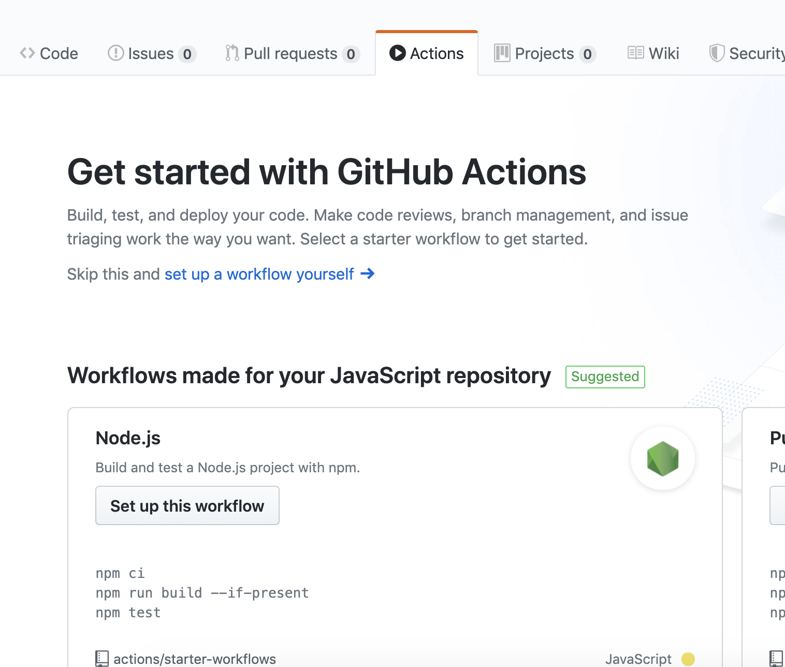
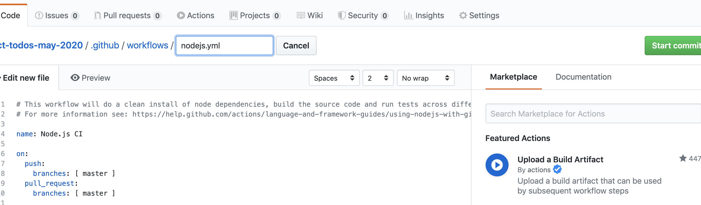

## To get tests working:
1) `npm i enzyme jest-enzyme enzyme-adapter-react-16`
1) in `setupTests.js`:
```
import '@testing-library/jest-dom/extend-expect';
import 'jest-enzyme';
import { configure } from 'enzyme';
import Adapter from 'enzyme-adapter-react-16';
configure({ adapter: new Adapter() });
```
1) Use snapshots:

```js
import React from 'react';
import { shallow } from 'enzyme';
import App from './App';

test('renders learn react link', () => {
  const wrapper = shallow(<App />);
  expect(wrapper).toMatchSnapshot();
});
```
1) Run tests locally to create a snapshot.
1) Make sure your snapshot is what you'd "expect" to see. 
1) ACP, then in github click `actions` then click `Set up this Workflow`
1) Click `Start Commit` in github to add CI.



---



## Define problem: Users don’t know how to use our todos api! Lets make a front end that lets them create, view, and complete their todos.

# Front end vertical Slices

## List Todos
	Use hard coded todos from .json file
		- console.log out the todos file in React code and see it in the browser
	Render simple todos on the page
		- I can see simple todos rendered in the browser
---
    Later: Make styles better
	Later: Use hard coded seed todos from SQL and express
		- We can log out data from the endpoint to react
		- We can see the endpoint data rendered in react components

## Create Todos
	- We need to add a form on the list page with a text input and a submit button
		- Make sure my event handlers work on the input and the button by logging out to the console onClick and on change
			- first, log out hello world
			- then, log out actual values from user input
	- Once I know my event handlers work, I want to put the new todo into my state on click
			- first, lets do it a fake, front-end todo
---
	Later: then, let’s hit out create todo route and make an ACTUAL todo to put on the page

## Complete Todos
	- When the user clicks on the todo, it should change to DONE (strikethru)
		- Make sure my event listeners work by logging out 1) hello world, then 2) the todo on click of Todo
		- Change state so that this todo is complete (all front-end)
			- console log state in render to validate that this happened
		- In render, if a todo is completed, style it differently
---
	Later, hook this up to back end
		

---
Create Users
Only show a single User’s todos
